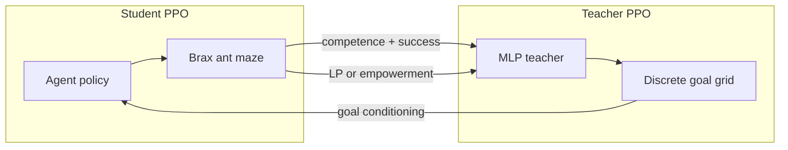

# Teacher-Assisted Goal-Conditioned Continuous Control

This repository trains a PPO **student** agent for continuous control in Brax ant-maze environments while an MLP **teacher** selects goals from a discrete grid. The student is goal-conditioned and receives a sparse goal-reach reward. The teacher is also trained with PPO and is rewarded at episode end based on how useful its goal choices are for the student's learning.

The two main entry points differ in **how the teacher is rewarded**:

- `[purejaxrl/ppo_continuous_action_custom_brax_with_teacher_simple_reward.py](purejaxrl/ppo_continuous_action_custom_brax_with_teacher_simple_reward.py)` — teacher trained with **learning progress (LP)** reward
- `[purejaxrl/ppo_continuous_action_custom_brax_with_teacher_emp_reward.py](purejaxrl/ppo_continuous_action_custom_brax_with_teacher_emp_reward.py)` — teacher trained with **empowerment** reward




## Installation

Install dependencies:

```bash
pip install -r requirements.txt
```

The training scripts also require `tyro`, `orbax-checkpoint`, and `wonderwords` (for optional checkpoint naming). Install them if they are not already present in your environment:

```bash
pip install tyro orbax-checkpoint wonderwords
```

For GPU acceleration, follow the [JAX installation guide](https://github.com/google/jax#installation) for your platform.

**Working directory:** run all commands from the repository root so imports like `envs.factory` resolve. The scripts set `MUJOCO_GL=osmesa` internally for headless rendering.

## Configuration

To list all available options:

```bash
python purejaxrl/ppo_continuous_action_custom_brax_with_teacher_simple_reward.py --help
python purejaxrl/ppo_continuous_action_custom_brax_with_teacher_emp_reward.py --help
```

Set `--WANDB_MODE=disabled` for dry runs without Weights & Biases logging.

## Shared Hyperparameters

These settings apply to both experiments.

### Environment


| Parameter        | Default                  | Notes                                                                                                                            |
| ---------------- | ------------------------ | -------------------------------------------------------------------------------------------------------------------------------- |
| `ENV_NAME`       | `ant_u_maze_single_goal` | Other ant mazes: `ant_u_maze`, `ant_big_maze`, `ant_hardest_maze` (see `[purejaxrl/envs/factory.py](purejaxrl/envs/factory.py)`) |
| `EPISODE_LENGTH` | `1000`                   | Max steps per episode                                                                                                            |
| `NORMALIZE_ENV`  | `True`                   | Normalize observations and rewards                                                                                               |


### Student PPO


| Parameter         | Default | Notes                                        |
| ----------------- | ------- | -------------------------------------------- |
| `LR`              | `3e-4`  | Learning rate (annealed if `ANNEAL_LR=True`) |
| `NUM_ENVS`        | `256`   | Parallel environments                        |
| `NUM_STEPS`       | `64`    | Rollout steps per update                     |
| `TOTAL_TIMESTEPS` | `5e7`   | Total environment steps                      |
| `UPDATE_EPOCHS`   | `4`     | PPO epochs per update                        |
| `NUM_MINIBATCHES` | `8`     | Minibatches per epoch                        |
| `GAE_LAMBDA`      | `0.8`   | GAE lambda                                   |
| `CLIP_EPS`        | `0.2`   | PPO clip epsilon                             |
| `ENT_COEF`        | `0.0`   | Entropy bonus                                |
| `HIDDEN_DIM`      | `256`   | Actor-critic hidden size                     |


### Goal Setup


| Parameter            | Default | Notes                                    |
| -------------------- | ------- | ---------------------------------------- |
| `ADD_GOAL_REWARD`    | `True`  | Add sparse goal-reach reward for student |
| `CONDITION_ON_GOAL`  | `True`  | Concatenate goal to student observations |
| `GOAL_REWARD_COEF`   | `1.0`   | Weight on goal-reach reward              |
| `GOAL_REACH_EPSILON` | `0.5`   | Distance threshold for goal reach        |


### Teacher Goal Space


| Parameter                                   | Default        | Notes                               |
| ------------------------------------------- | -------------- | ----------------------------------- |
| `TEACHER_GOAL_X_MIN` / `TEACHER_GOAL_X_MAX` | `4.0` / `12.0` | Goal grid x bounds                  |
| `TEACHER_GOAL_Y_MIN` / `TEACHER_GOAL_Y_MAX` | `4.0` / `12.0` | Goal grid y bounds                  |
| `TEACHER_NUM_GOAL_POINTS`                   | `30`           | Grid resolution (30×30 = 900 goals) |
| `TEACHER_HIDDEN_DIM`                        | `256`          | Teacher MLP hidden size             |


### Teacher PPO


| Parameter                         | Default | Notes                                   |
| --------------------------------- | ------- | --------------------------------------- |
| `TEACHER_LR`                      | `3e-4`  | Teacher learning rate                   |
| `TEACHER_ROLLOUT_BUFFER_SIZE`     | `4`     | Episodes buffered before teacher update |
| `TEACHER_UPDATE_EPOCHS`           | `4`     | PPO epochs for teacher                  |
| `TEACHER_NUM_MINIBATCHES`         | `8`     | Teacher minibatches per epoch           |
| `CONDITION_TEACHER_ON_COMPETENCE` | `True`  | Feed competence vector to teacher       |


Teacher reward at episode end is composed of:

- **success_part** — episode success signal
- **reward-specific term** — learning progress or empowerment (see below)


### Logging


| Parameter    | Default     | Notes                            |
| ------------ | ----------- | -------------------------------- |
| `PROJECT`    | `purejaxrl` | W&B project name                 |
| `ENTITY`     | `""`        | W&B entity                       |
| `WANDB_MODE` | `online`    | Set to `disabled` for no logging |
| `SEED`       | `30`        | Random seed                      |
| `COMMENT`    | `""`        | Free-text run description        |


## Experiment A: Learning Progress Teacher

**Script:** `[purejaxrl/ppo_continuous_action_custom_brax_with_teacher_simple_reward.py](purejaxrl/ppo_continuous_action_custom_brax_with_teacher_simple_reward.py)`

At episode end, the teacher receives **learning progress** reward: the change in per-goal success rate since the episode started (`end_rates - episode_goal_success_start`). Set `ABSOLUTE_LEARNING_PROGRESS` to take the absolute value.

### Reward-Specific Defaults


| Parameter                           | Default | Notes                                                         |
| ----------------------------------- | ------- | ------------------------------------------------------------- |
| `USE_LEARNING_PROGRESS_REWARD`      | `True`  | Enable LP teacher reward                                      |
| `TASK_REWARD_COEF`                  | `1.0`   | Scales Brax task reward for student (**only in this script**) |
| `ABSOLUTE_LEARNING_PROGRESS`        | `False` | Use absolute LP values                                        |
| `NUM_EVAL_ENVS`                     | `4`     | Envs used for competence evaluation                           |
| `TEACHER_SOFTMAX_VIZ_NUM_SNAPSHOTS` | `0`     | In-training teacher softmax visuals (0 = disabled)            |


### Sample Run

```bash
python purejaxrl/ppo_continuous_action_custom_brax_with_teacher_simple_reward.py \
  --ENV_NAME=ant_u_maze_single_goal \
  --TOTAL_TIMESTEPS=300000000 \
  --LR=0.0003 \
  --NUM_ENVS=256 \
  --NUM_STEPS=64 \
  --HIDDEN_DIM=256 \
  --NUM_MINIBATCHES=8 \
  --UPDATE_EPOCHS=4 \
  --GAE_LAMBDA=0.8 \
  --CLIP_EPS=0.2 \
  --ENT_COEF=0 \
  --NORMALIZE_ENV \
  --ADD_GOAL_REWARD \
  --CONDITION_ON_GOAL \
  --GOAL_REWARD_COEF=1 \
  --USE_LEARNING_PROGRESS_REWARD \
  --no-ABSOLUTE_LEARNING_PROGRESS \
  --TEACHER_ROLLOUT_BUFFER_SIZE=4 \
  --TEACHER_NUM_MINIBATCHES=8 \
  --TEACHER_UPDATE_EPOCHS=4 \
  --TASK_REWARD_COEF=1 \
  --NUM_EVAL_ENVS=4 \
  --TEACHER_SOFTMAX_VIZ_NUM_SNAPSHOTS=100 \
  --SEED=30 \
  --PROJECT=purejaxrl_continuous_control_with_goals_from_mlp_teacher_simple_reward
```


### Hyperparameters to Sweep

From `[scripts/ppo_continuous_control_with_goal_conditining_and_goal_reward_from_mlp_teacher_lp.sh](scripts/ppo_continuous_control_with_goal_conditining_and_goal_reward_from_mlp_teacher_lp.sh)`:


| Parameter                     | Values                             |
| ----------------------------- | ---------------------------------- |
| `TEACHER_ROLLOUT_BUFFER_SIZE` | 2, 10, 30                          |
| `TEACHER_NUM_MINIBATCHES`     | 4, 8, 16, 32                       |
| `TEACHER_UPDATE_EPOCHS`       | 2, 4, 8, 10                        |
| `TASK_REWARD_COEF`            | 1, 2, 5                            |
| `NUM_EVAL_ENVS`               | 4, 8                               |
| `SEED`                        | multiple seeds for reproducibility |


### Cluster Submission

For SLURM batch runs on a cluster, use the sweep script with `[scripts/submit_job](scripts/submit_job)`:

```bash
bash scripts/ppo_continuous_control_with_goal_conditining_and_goal_reward_from_mlp_teacher_lp.sh
```

Adapt the conda environment path and SLURM partition in `scripts/submit_job` for your cluster.

## Experiment B: Empowerment Teacher

**Script:** `[purejaxrl/ppo_continuous_action_custom_brax_with_teacher_emp_reward.py](purejaxrl/ppo_continuous_action_custom_brax_with_teacher_emp_reward.py)`

Trains an **EmpowermentModel** (contrastive encoders) based on [https://arxiv.org/abs/2411.02623](https://arxiv.org/abs/2411.02623) online from a contrastive-learning episode buffer. At episode end, the teacher receives empowerment reward `e(action_cond, future) - e(context, future)` (InfoNCE-style), scaled by `TEACHER_EMPOWERMENT_REWARD_COEF`.

### Reward-Specific Defaults


| Parameter                         | Default       | Notes                                                |
| --------------------------------- | ------------- | ---------------------------------------------------- |
| `USE_TEACHER_EMPOWERMENT_REWARD`  | `True`        | Enable empowerment teacher reward                    |
| `USE_LEARNING_PROGRESS_REWARD`    | `False`       | LP disabled by default                               |
| `TEACHER_EMPOWERMENT_REWARD_COEF` | `1.0`         | Scale on empowerment reward                          |
| `GAMMA_CL`                        | `0.99`        | Discount for future-state sampling                   |
| `CL_BUFFER_SIZE`                  | `1000`        | Contrastive-learning episode buffer size             |
| `EMPOWERMENT_LR`                  | `3e-4`        | Initial empowerment model learning rate; linearly annealed when `ANNEAL_LR=True` |
| `EMPOWERMENT_REPR_DIM`            | `64`          | Representation dimension                             |
| `EMPOWERMENT_HIDDEN_DIM`          | `256`         | Empowerment MLP hidden size                          |
| `EMPOWERMENT_UPDATE_EPOCHS`       | `1`           | Training epochs per empowerment update               |
| `EMPOWERMENT_NUM_MINIBATCHES`     | `128`         | Minibatches per empowerment epoch                    |
| `EMPOWERMENT_ENERGY_FN`           | `l2`          | Options: `l2`, `norm`, `dot`, `cosine`               |
| `EMPOWERMENT_CONTRASTIVE_LOSS`    | `fwd_infonce` | Options: `fwd_infonce`, `bwd_infonce`, `sym_infonce` |


### Sample Run

```bash
python purejaxrl/ppo_continuous_action_custom_brax_with_teacher_emp_reward.py \
  --ENV_NAME=ant_u_maze_single_goal \
  --TOTAL_TIMESTEPS=300000000 \
  --LR=0.0003 \
  --NUM_ENVS=256 \
  --NUM_STEPS=64 \
  --HIDDEN_DIM=256 \
  --NUM_MINIBATCHES=16 \
  --UPDATE_EPOCHS=4 \
  --GAE_LAMBDA=0.8 \
  --CLIP_EPS=0.2 \
  --ENT_COEF=0 \
  --NORMALIZE_ENV \
  --ADD_GOAL_REWARD \
  --CONDITION_ON_GOAL \
  --GOAL_REWARD_COEF=1 \
  --no-USE_LEARNING_PROGRESS_REWARD \
  --USE_TEACHER_EMPOWERMENT_REWARD \
  --no-ABSOLUTE_LEARNING_PROGRESS \
  --TEACHER_ROLLOUT_BUFFER_SIZE=4 \
  --GAMMA_CL=0.9 \
  --EMPOWERMENT_UPDATE_EPOCHS=2 \
  --EMPOWERMENT_NUM_MINIBATCHES=128 \
  --EMPOWERMENT_ENERGY_FN=l2 \
  --EMPOWERMENT_CONTRASTIVE_LOSS=fwd_infonce \
  --SEED=30 \
  --PROJECT=purejaxrl_continuous_control_with_goals_from_mlp_teacher_emp_reward
```


### Hyperparameters to Sweep

From `[scripts/ppo_continuous_control_with_goal_conditining_and_goal_reward_from_mlp_teacher_emp.sh](scripts/ppo_continuous_control_with_goal_conditining_and_goal_reward_from_mlp_teacher_emp.sh)`:


| Parameter                      | Values                                |
| ------------------------------ | ------------------------------------- |
| `TEACHER_ROLLOUT_BUFFER_SIZE`  | 1, 2, 4, 30                           |
| `GAMMA_CL`                     | 0.9, 0.8, 0.6                         |
| `EMPOWERMENT_UPDATE_EPOCHS`    | 1, 2, 4                               |
| `EMPOWERMENT_NUM_MINIBATCHES`  | 128, 256                              |
| `EMPOWERMENT_ENERGY_FN`        | l2, norm, dot, cosine                 |
| `EMPOWERMENT_CONTRASTIVE_LOSS` | fwd_infonce, bwd_infonce, sym_infonce |


---

Built on [PureJaxRL](https://github.com/luchris429/purejaxrl).